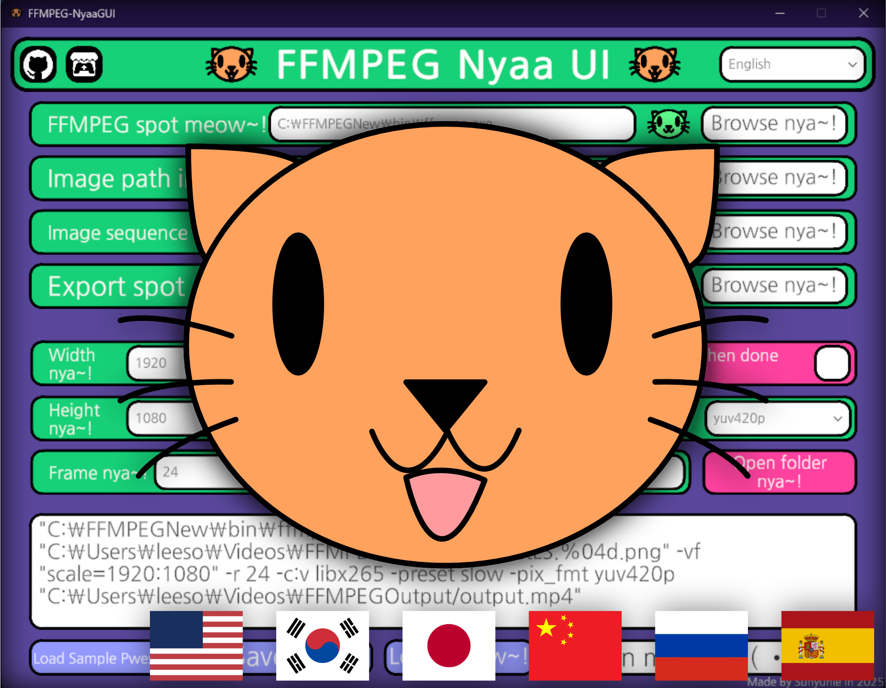

# FFMPEG-NyaaGUI😽
A Simple & Cute FFMPEG UI Project made with Unity! (=ↀωↀ=)✧

This tool provides an easy-to-use interface for running FFMPEG commands,  
with support for setting presets, saving/loading configurations,  
and choosing files/folders through a native dialog system.

> **Important!**  
> Before using this tool, please install a prebuilt FFMPEG binary  
> from [https://github.com/btbn/ffmpeg-builds/releases](https://github.com/btbn/ffmpeg-builds/releases)  
> and place it in a location of your choice.  
> You will need to provide the path to `ffmpeg.exe` during setup.

## Features ✨

🌐 **Multi-language Support:**  
English, Korean, Japanese, Chinese, Russian, and Spanish — all covered nya! (=ↀωↀ=)✧

🎬 **Auto Image Sequence Setup:**  
Automatically detects your image sequences so you can focus on making cool videos! (ฅ^ω^ฅ)💖

## 🐾 How to Use FFMPEG-NyaaGUI (=^･ω･^=)

1. **Download a prebuilt FFMPEG binary** from  
   👉 [https://github.com/btbn/ffmpeg-builds/releases](https://github.com/btbn/ffmpeg-builds/releases)

2. **Unzip and install FFMPEG** anywhere you like!  
   - Just remember the path, nya~ 🗂️  
   - Not sure where to put it? Installing it directly in `C:\` is totally fine!  
   - When launching the app, point it to `ffmpeg.exe` inside the `bin` folder!

3. **Select the folder** where your rendered images (image sequence) are stored. 📁  
   - Just choose the **first frame** of the image sequence!  
   - The program will automatically fill in the sequence pattern for you 🎞️✨  
   - (You can also enter it manually if you prefer, no problem nya~!)

4. **Choose the output folder** and **file name**.  
   - **Tip:** Don’t forget to add `.mp4` at the end of the file name!

5. **Set the resolution** and **frame rate** that match your project.

6. **Encoding options:**  
   - For the **best quality**, choose `h265` (HEVC)  
   - For **YouTube uploads**, `webm` is a good choice too!

7. **Encoding speed:**  
   - `slow` is recommended for a nice balance of quality and performance 🐢✨

8. **Pixel format:**  
   - For **compatibility**, use `yuv420p`  
   - For **maximum visual quality**, use `yuv444p`  
   - To **preserve alpha**, use `yuva420p`

9. When everything is ready, the command will be generated at the bottom!  
   - You can **copy & paste** it into a command window  
   - Or just click the **Run** button to start encoding right away nya! 🎉

---

That's it! Super easy, right? (ฅ^•ﻌ•^ฅ)💕  
Now go make something amazing, nya~! 🎬😽

---

## What's Used 🐾

This project is powered by:

- **[UnityStandaloneFileBrowser](https://github.com/gkngkc/UnityStandaloneFileBrowser)**  
  For native file/folder dialog support on Windows, macOS, and Linux

- **Unity Engine**  
  The base framework for GUI interaction and logic

- **FFMPEG**  
  For actual video encoding and processing (user must provide the executable)

- **[DOTween](https://github.com/Demigiant/dotween)**  
   For smooth and efficient tweening animations within the Unity UI

---

## Fonts

This project uses the **Nanum Gothic** font, which is licensed under the SIL Open Font License (OFL).

- Nanum Gothic © NAVER Corp.  
- Licensed under the SIL Open Font License (OFL)  
- https://github.com/naver/nanumfont

Please refer to the license file included in the `Fonts` folder for more information.
