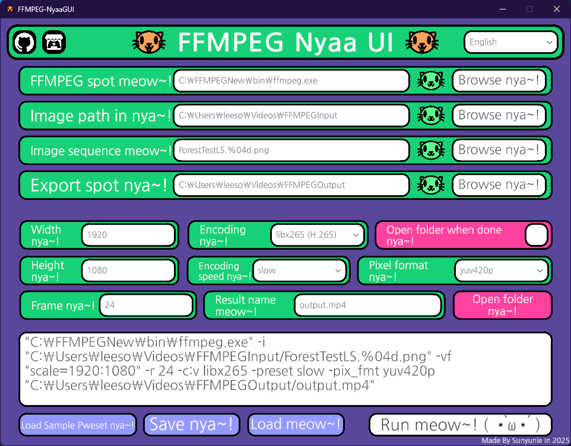

# FFMPEG-NyaaGUI😽
A Simple & Cute FFMPEG UI Project made with Unity! (=ↀωↀ=)✧

This tool provides an easy-to-use interface for running FFMPEG commands,  
with support for setting presets, saving/loading configurations,  
and choosing files/folders through a native dialog system.

> **Important!**  
> Before using this tool, please install a prebuilt FFMPEG binary  
> from [https://github.com/btbn/ffmpeg-builds/releases](https://github.com/btbn/ffmpeg-builds/releases)  
> and place it in a location of your choice.  
> You will need to provide the path to `ffmpeg.exe` during setup.

---

## What's Used 🐾

This project is powered by:

- **[UnityStandaloneFileBrowser](https://github.com/gkngkc/UnityStandaloneFileBrowser)**  
  For native file/folder dialog support on Windows, macOS, and Linux

- **Unity Engine**  
  The base framework for GUI interaction and logic

- **FFMPEG**  
  For actual video encoding and processing (user must provide the executable)

---

## Fonts

This project uses the **Nanum Gothic** font, which is licensed under the SIL Open Font License (OFL).

- Nanum Gothic © NAVER Corp.  
- Licensed under the SIL Open Font License (OFL)  
- https://github.com/naver/nanumfont

Please refer to the license file included in the `Fonts` folder for more information.
